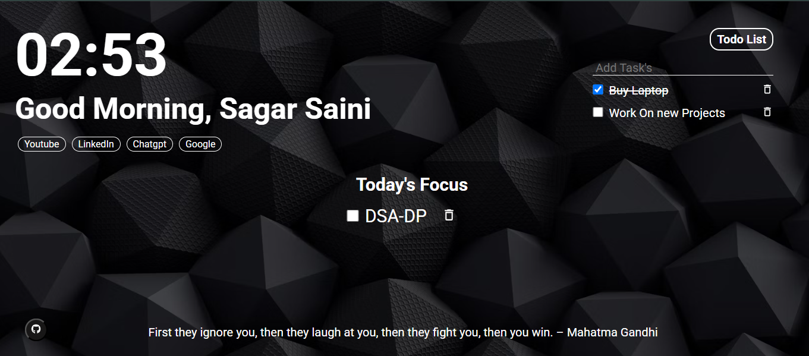

# Browser Extension - Personalized New Tab Page

A React-based browser extension that transforms your new tab page into a personalized dashboard with a beautiful background, time display, daily focus task, todo list, and inspirational quotes.

## Features
- **Personalized Greeting**: Displays a greeting with the user's name and time-based message (Good Morning, Good Afternoon, etc.)
- **Current Time Display**: Shows the current time in a large, easy-to-read format
- **Daily Focus**: Set and track your main task for the day
- **Todo List**: Create, complete, and delete tasks in a persistent todo list
- **Inspirational Quotes**: Displays random inspirational quotes
- **Quick Links**: Easy access to common websites like YouTube, LinkedIn, ChatGPT, and Google
- **Beautiful Background**: Aesthetic background image for a pleasant browsing experience
- **Persistent Storage**: All user data is saved in localStorage for a consistent experience

## Screenshots and Demo
### Screenshot


### Demo Video
[Watch the demo video](assets/React%20App%20-%20Google%20Chrome%202025-06-12%2002-49-00.mp4)

## Technologies Used
- React.js
- Framer Motion (for animations)
- React Icons
- UUID (for unique IDs)
- Local Storage (for data persistence)

## Installation
1. Clone the repository:
```bash
git clone https://github.com/yourusername/browser-extension.git
cd browser-extension
```

2. Install dependencies:
```bash
npm install
```

3. Start the development server:
```bash
npm start
```

4. Build for production:
```bash
npm run build
```

## Usage
1. When you first open the extension, you'll be prompted to enter your name
2. After entering your name, you'll see your personalized dashboard with:
   - Current time
   - Personalized greeting
   - Option to set a main focus for the day
   - Access to your todo list
   - Random inspirational quote
   - Quick links to popular websites

3. To add a main focus for the day, type your task and press Enter
4. To access your todo list, click the "Todo List" button
5. To add tasks to your todo list, type the task and press Enter
6. To mark a task as complete, click the checkbox next to it
7. To delete a task, click the delete icon

## Project Structure
```
browser-extension/
├── public/             # Public assets
├── src/
│   ├── Components/     # Reusable components
│   │   ├── Todo/       # Todo component
│   │   └── Todolist/   # Individual todo item component
│   ├── context/        # React context for state management
│   ├── db/             # Static data (quotes, images)
│   ├── pages/          # Page components
│   │   ├── home/       # Initial name input page
│   │   └── Task/       # Main dashboard page
│   ├── App.js          # Main application component
│   └── index.js        # Application entry point
└── package.json        # Project dependencies and scripts
```

## Contributing
Contributions are welcome! Please feel free to submit a Pull Request.

## License
This project is licensed under the MIT License - see the LICENSE file for details.

## Acknowledgements
- [React](https://reactjs.org/)
- [Framer Motion](https://www.framer.com/motion/)
- [React Icons](https://react-icons.github.io/react-icons/)
